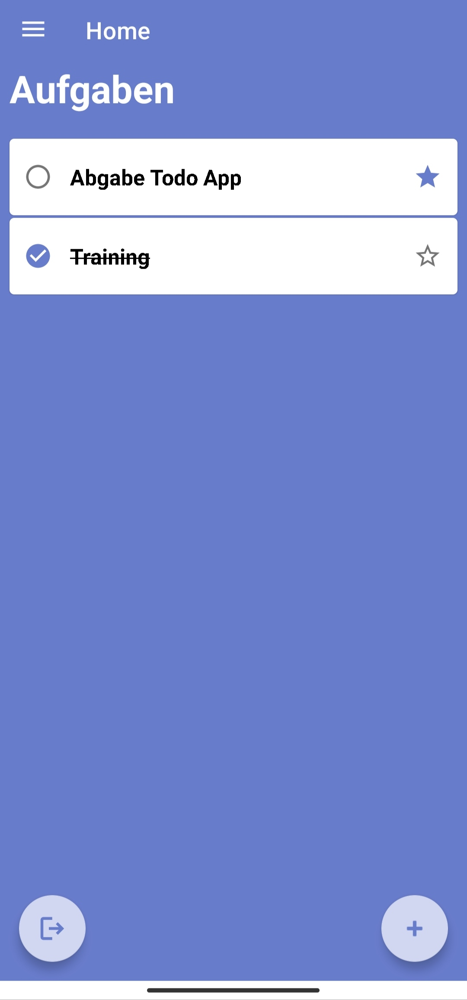
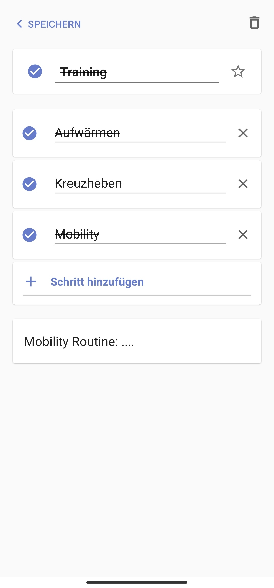

# Kotlin To Do

* Für das Modul Mobile App Development an der Hochschule Furtwangen
* Ein einacher Microsoft To Do Klon, umgesetzt in Kotlin für Android
* Authentifizierung per Firebase Auth
* Persistenz durch Firebase Firestore

> ⚠️ Der PlayStore ist Voraussetzung um die App zu nutzen

## Einblicke

| List                          | Detail                            | Detail                            |
| ----------------------------- |---------------------------------- | --------------------------------- |
|  |  |  |

